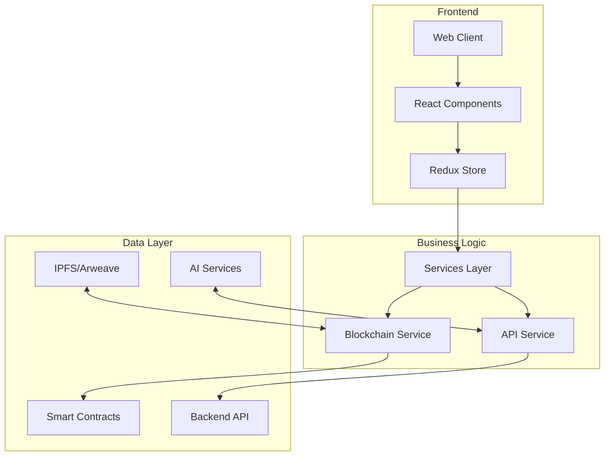
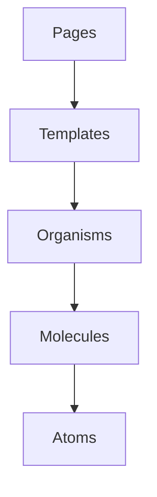
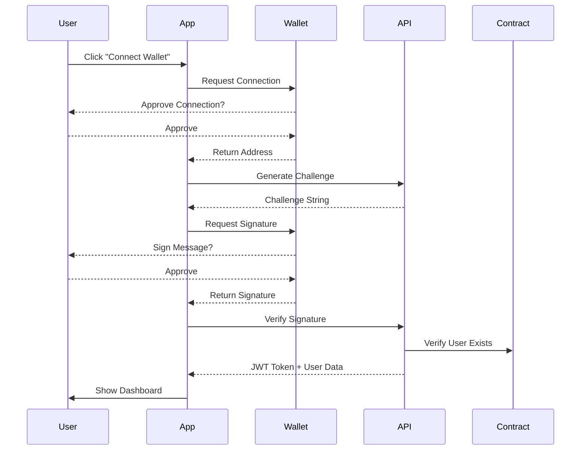
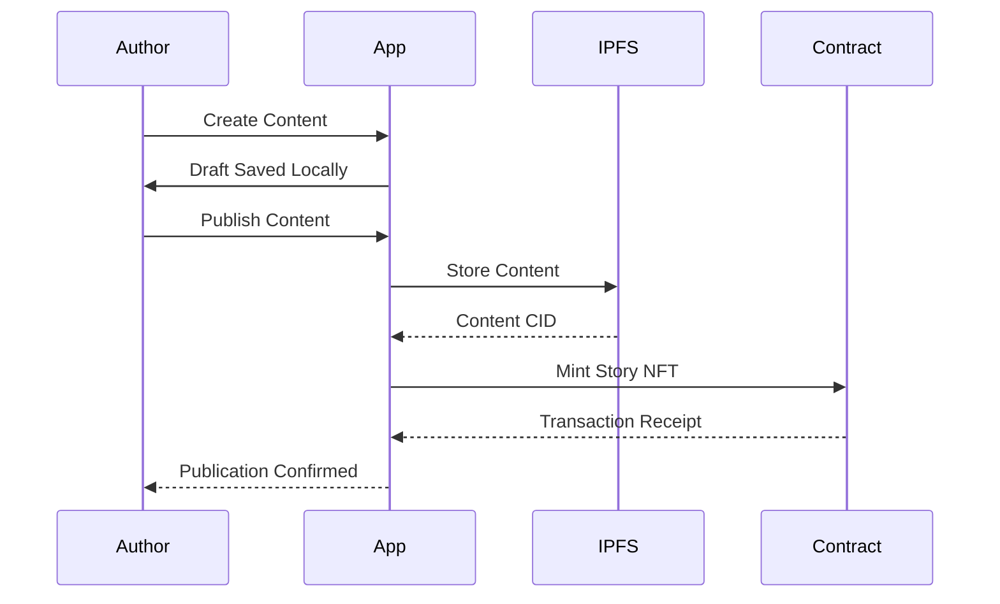
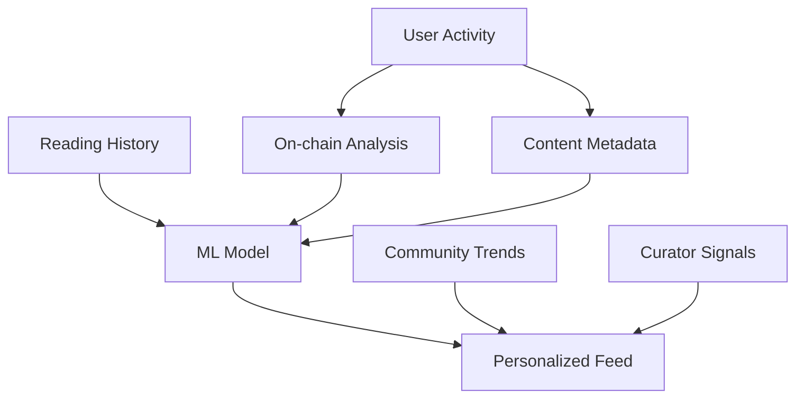
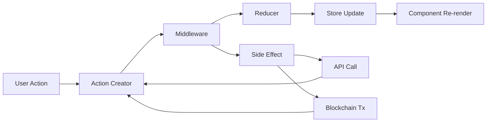
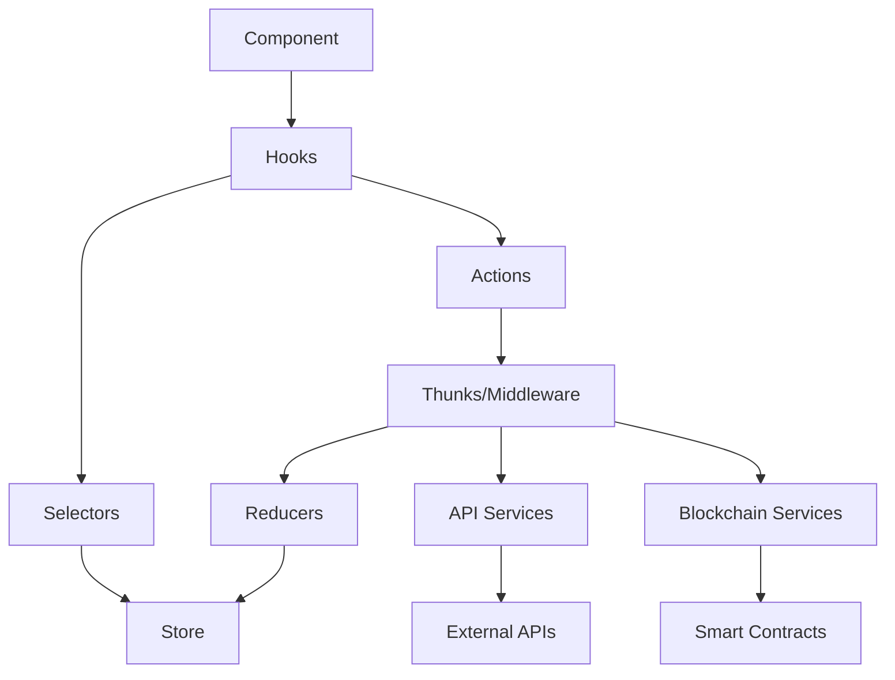

# Ctory

<div align="center">
  
  
  <p>
    <strong>Decentralized Storytelling Platform</strong>
  </p>
  
  <p>
    <a href="https://github.com/CtoryAI/Ctory/issues">Report Bug</a>
    ·
    <a href="https://github.com/CtoryAI/Ctory/issues">Request Feature</a>
  </p>
  
  <p>
    <a href="LICENSE"></a>
    
    
  </p>
</div>

## Overview

Ctory is a decentralized platform that revolutionizes storytelling through blockchain technology. It enables creators to publish and monetize content with full ownership while readers can discover immersive stories in a web3-powered ecosystem.

### Vision

To create a global, censorship-resistant platform for storytellers that provides equitable compensation, ownership, and discovery through decentralized technologies.

### Key Differentiators

- **True Ownership**: All content is stored on decentralized storage with creator-owned NFTs
- **AI-Enhanced Creation**: Integrated AI tools to assist storytellers
- **Cross-chain Compatibility**: Support for multiple blockchain networks
- **Community Governance**: Platform decisions driven by token holders

## Table of Contents

- [Architecture](#architecture)
- [Technology Stack](#technology-stack)
- [Project Structure](#project-structure)
- [Core Features](#core-features)
- [Data Flow](#data-flow)
- [Getting Started](#getting-started)
- [Development](#development)
- [Security](#security)
- [Performance Optimization](#performance-optimization)
- [Testing Strategy](#testing-strategy)
- [Deployment](#deployment)
- [Roadmap](#roadmap)
- [FAQ](#faq)
- [Contributing](#contributing)
- [Acknowledgements](#acknowledgements)
- [License](#license)

## Architecture



The application follows a layered architecture with clear separation of concerns:

### 1. Presentation Layer

The presentation layer is built with React and follows atomic design principles:



- **Atoms**: Smallest UI components (buttons, inputs, icons)
- **Molecules**: Simple UI components formed by atoms (search form, menu items)
- **Organisms**: Complex UI components (headers, story cards)
- **Templates**: Page layouts without specific content
- **Pages**: Complete views with specific content

### 2. Business Logic Layer

The business logic is encapsulated in services that handle:

- Authentication and authorization
- Web3 interactions (wallet connections, contract calls)
- Content management (creation, retrieval, updates)
- Notifications and messaging

### 3. Data Layer

The data layer consists of:

- **Blockchain**: Smart contracts for ownership and transactions
- **Decentralized Storage**: IPFS/Arweave for content storage
- **API Services**: Backend services for additional functionality
- **Local Storage**: For caching and offline capabilities

## Technology Stack

### Frontend
- **Framework**: React 18 with TypeScript
- **State Management**: Redux Toolkit with RTK Query
- **Styling**: Tailwind CSS with custom theming
- **Component Library**: Custom component system
- **Routing**: React Router v6
- **Form Handling**: Formik with Yup validation

### Web3 Integration
- **Wallet Connection**: ethers.js v6
- **Contract Interaction**: ethers.js + custom hooks
- **Storage**: IPFS via web3.storage
- **Identity**: ENS integration

### Development Tools
- **Build Tool**: Vite
- **Package Manager**: npm
- **Linting**: ESLint with custom ruleset
- **Formatting**: Prettier
- **Testing**: Jest, React Testing Library, Cypress
- **CI/CD**: GitHub Actions

### API Integration
- **HTTP Client**: Axios with interceptors
- **Authentication**: JWT + Wallet signatures
- **Caching**: RTK Query with localStorage persistence

## Project Structure

```
ctory/
├── public/              # Static files
├── src/
│   ├── api/             # API client and endpoints
│   ├── assets/          # Static assets
│   ├── components/      # Reusable UI components
│   │   ├── atoms/       # Basic UI elements
│   │   ├── molecules/   # Composite components
│   │   ├── organisms/   # Complex components
│   │   └── templates/   # Page templates
│   ├── constants/       # Application constants
│   ├── contexts/        # React contexts
│   ├── core/            # Core configuration
│   ├── features/        # Feature-based modules
│   │   ├── auth/        # Authentication feature
│   │   ├── stories/     # Stories feature
│   │   └── profile/     # User profile feature
│   ├── hooks/           # Custom React hooks
│   ├── layouts/         # Layout components
│   ├── pages/           # Page components
│   ├── routes/          # Routing configuration
│   ├── services/        # Business logic services
│   │   ├── auth/        # Authentication service
│   │   ├── blockchain/  # Blockchain service
│   │   └── ipfs/        # IPFS service
│   ├── store/           # Redux store and slices
│   ├── styles/          # Global styles
│   ├── types/           # TypeScript types
│   ├── utils/           # Utility functions
│   ├── App.tsx          # Main App component
│   └── index.tsx        # Entry point
├── .env.example         # Example environment variables
├── .eslintrc.js         # ESLint configuration
├── .gitignore           # Git ignore rules
├── .nvmrc               # Node version
├── LICENSE              # MIT License
├── package.json         # Package configuration
├── postcss.config.js    # PostCSS configuration
├── README.md            # Project documentation
├── tailwind.config.js   # Tailwind CSS configuration
├── tsconfig.json        # TypeScript configuration
└── vite.config.ts       # Vite configuration
```

## Core Features

### 1. Authentication System

The authentication flow combines traditional Web2 authentication with Web3 wallet-based authentication:



### 2. Content Creation and Publishing

The content creation and publishing flow:



### 3. Discovery and Recommendations

The platform uses a hybrid recommendation system combining on-chain data with traditional recommendation algorithms:



### 4. Monetization

Multiple monetization strategies are supported:

- **Direct Sales**: One-time purchases of NFT content
- **Subscriptions**: Recurring access passes
- **Tipping**: Reader-to-author direct payments
- **Patronage**: Long-term support commitments
- **Revenue Sharing**: Collaborative creation rewards

## Data Flow

The application uses unidirectional data flow through Redux with side effects managed by middleware:



### State Management Architecture



## Getting Started

### Prerequisites

- Node.js v18.19.0 or higher
- npm v9 or higher
- MetaMask or other Web3 wallet
- Modern web browser (Chrome, Firefox, Brave, Edge)

### Installation

1. Clone the repository
```bash
git clone https://github.com/CtoryAI/Ctory.git
cd Ctory
```

2. Install dependencies
```bash
npm install
```

3. Create environment file
```bash
cp .env.example .env
```

4. Configure environment variables
```
VITE_API_URL=http://localhost:3000/api
VITE_CONTRACT_ADDRESS=0x...
VITE_CONTRACT_ABI=[]
VITE_IPFS_GATEWAY=https://ipfs.io
VITE_IPFS_PROJECT_ID=your_ipfs_project_id
VITE_IPFS_PROJECT_SECRET=your_ipfs_project_secret
VITE_AI_API_KEY=your_ai_api_key
VITE_AI_API_URL=https://api.example.com
```

5. Start development server
```bash
npm run dev
```

## Development

### Wallet Integration

```typescript
// Example of using the wallet hook
const { connect, disconnect, address, isConnected } = useWallet();

// In your component
return (
  <Button 
    onClick={isConnected ? disconnect : connect}
  >
    {isConnected ? `Disconnect (${shortenAddress(address)})` : 'Connect Wallet'}
  </Button>
);
```

### Smart Contract Interaction

```typescript
// Example of interacting with a smart contract
const { contract } = useContract(CONTRACT_ADDRESS, CONTRACT_ABI);

const publishStory = async (metadataURI: string) => {
  if (!contract) return;
  
  try {
    const tx = await contract.mintStory(metadataURI);
    await tx.wait();
    // Handle success
  } catch (error) {
    // Handle error
  }
};
```

### Content Storage

```typescript
// Example of storing content on IPFS
const { storeContent, isLoading } = useIPFS();

const saveStory = async (content: StoryContent) => {
  try {
    const cid = await storeContent(content);
    return `ipfs://${cid}`;
  } catch (error) {
    // Handle error
    return null;
  }
};
```

### Protected Routes

```typescript
// Example of protected route component usage
const AppRoutes = () => (
  <Routes>
    <Route path="/" element={<HomePage />} />
    <Route path="/login" element={<LoginPage />} />
    <Route path="/dashboard" element={
      <ProtectedRoute>
        <DashboardPage />
      </ProtectedRoute>
    } />
    <Route path="/create" element={
      <ProtectedRoute>
        <CreateStoryPage />
      </ProtectedRoute>
    } />
  </Routes>
);
```

## Security

### Smart Contract Security

- All contracts audited by independent security firms
- Formal verification for critical functions
- Extensive test coverage with property-based testing
- Time-locked admin functions with multi-sig requirements

### Frontend Security

- Input validation on both client and server side
- Content Security Policy implementation
- Regular dependency audits
- XSS and CSRF protection

### User Security Best Practices

- Hardware wallet support
- Transaction simulation before submission
- Gas estimation and optimization
- Clear transaction information display

## Performance Optimization

### Code Splitting

The application uses dynamic imports to split code by routes:

```typescript
const HomePage = lazy(() => import('./pages/HomePage'));
const DashboardPage = lazy(() => import('./pages/DashboardPage'));
```

### Asset Optimization

- Images are optimized at build time
- SVG optimization with SVGO
- Critical CSS inlining
- Font subsetting and optimization

### State Management

- Selective state persistence
- Normalized Redux store structure
- Memoized selectors with Reselect
- Optimistic UI updates

## Testing Strategy

### Unit Testing

```typescript
// Example of a reducer test
describe('authReducer', () => {
  it('should handle user login', () => {
    const initialState = { user: null, isAuthenticated: false };
    const action = setUser({ id: '1', address: '0x...' });
    const newState = authReducer(initialState, action);
    
    expect(newState.user).toEqual({ id: '1', address: '0x...' });
    expect(newState.isAuthenticated).toBe(true);
  });
});
```

### Integration Testing

Integration tests focus on interaction between components and services:

```typescript
// Example integration test
test('user can connect wallet and login', async () => {
  renderWithProviders(<LoginPage />);
  
  await userEvent.click(screen.getByText('Connect Wallet'));
  // Mock wallet connection response
  
  expect(await screen.findByText('Dashboard')).toBeInTheDocument();
  expect(mockNavigate).toHaveBeenCalledWith('/dashboard');
});
```

### End-to-End Testing

E2E tests use Cypress to simulate user journeys:

```javascript
// Example Cypress test
describe('Story Creation', () => {
  beforeEach(() => {
    cy.login();
    cy.visit('/create');
  });
  
  it('allows creating and publishing a story', () => {
    cy.get('input[name="title"]').type('My Test Story');
    cy.get('textarea[name="content"]').type('This is the content of my test story.');
    cy.get('button[type="submit"]').click();
    
    cy.url().should('include', '/story/');
    cy.contains('My Test Story').should('be.visible');
  });
});
```

## Deployment

### Production Build

```bash
npm run build
```

This creates optimized production files in the `dist` directory.

### Continuous Integration

GitHub Actions workflows:

```yaml
name: CI

on:
  push:
    branches: [ main, develop ]
  pull_request:
    branches: [ main, develop ]

jobs:
  build:
    runs-on: ubuntu-latest
    steps:
      - uses: actions/checkout@v3
      - uses: actions/setup-node@v3
        with:
          node-version: 18
      - run: npm ci
      - run: npm run lint
      - run: npm test
      - run: npm run build
```

### Deployment Options

- **Decentralized**: IPFS + ENS
- **Traditional**: AWS, Vercel, Netlify
- **Hybrid**: Centralized API + Decentralized Frontend

## Roadmap

### Q2 2025
- Initial platform launch
- Basic Web3 integration
- Story creation and publishing

### Q3 2025
- Enhanced user profiles
- Social features (comments, likes)
- Mobile responsive design

### Q4 2025
- Multi-chain support
- Improved recommendation system
- Advanced monetization options

### Q1 2026
- Governance system
- Creator communities
- Enhanced analytics

### Q2 2026
- Mobile applications
- AI-assisted creation tools
- Cross-platform integration

## FAQ

### General Questions

**Q: What is Ctory?**  
A: Ctory is a decentralized platform that empowers storytellers to create, share, and monetize their content with full ownership and control through blockchain technology.

**Q: Why blockchain?**  
A: Blockchain provides verifiable ownership, transparent monetization, censorship resistance, and direct creator-audience relationships without intermediaries.

### Technical Questions

**Q: Which blockchains are supported?**  
A: Initially Ethereum and Polygon, with plans to support additional EVM-compatible chains.

**Q: How is content stored?**  
A: Content is stored on IPFS with metadata and ownership recorded on-chain.

**Q: Is a wallet required?**  
A: A Web3 wallet is required for publishing and monetization features, but reading content can be done without one.

## Contributing

We welcome contributions from the community! Here's how to get started:

1. Fork the repository
2. Create your feature branch: `git checkout -b feature/amazing-feature`
3. Commit your changes: `git commit -m 'Add amazing feature'`
4. Push to the branch: `git push origin feature/amazing-feature`
5. Open a Pull Request

### Development Guidelines

- Follow the established code style
- Write tests for new features
- Update documentation
- Make atomic commits with clear messages

## Acknowledgements

- [React](https://reactjs.org/)
- [Solana](https://solana.com/)
- [IPFS](https://ipfs.io/)
- [Tailwind CSS](https://tailwindcss.com/)
- [ethers.js](https://docs.ethers.io/)
- [OpenZeppelin](https://openzeppelin.com/)

## License

This project is licensed under the MIT License - see the [LICENSE](LICENSE) file for details.

## Links

- Website: [www.ctory.xyz](https://www.ctory.xyz)
- Twitter: [@Ctory_](https://x.com/Ctory_)
- GitHub: [CtoryAI/Ctory](https://github.com/CtoryAI/Ctory) 